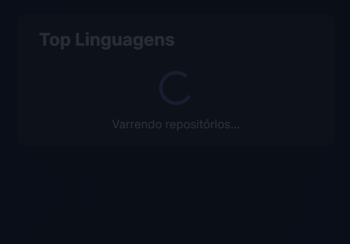
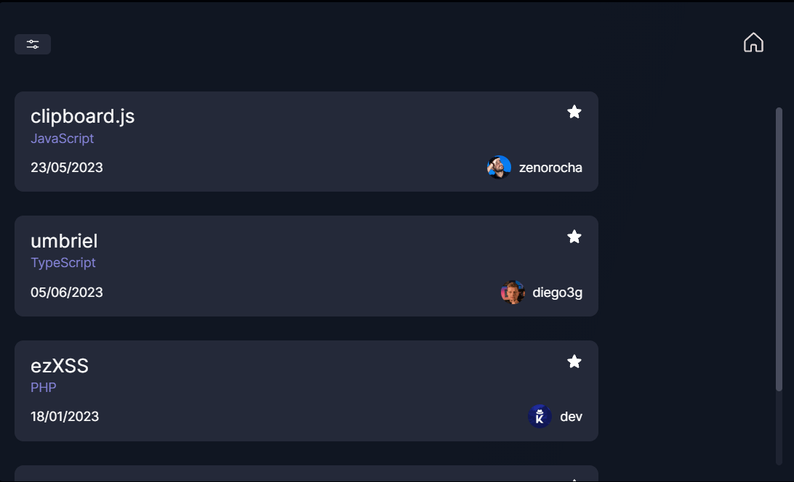
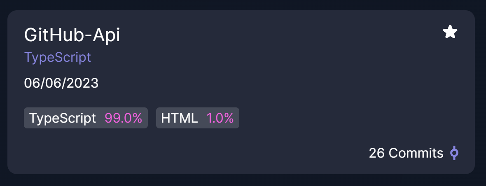
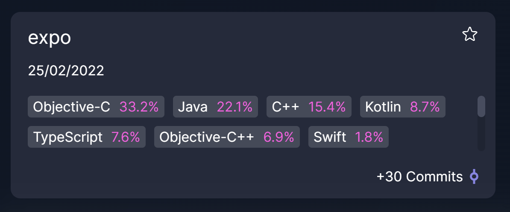
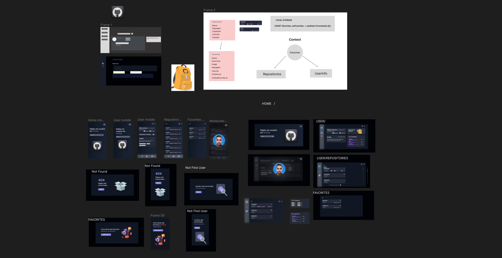

<h1 align="center"> Git Api  </h1>

## 💻 Projeto


<p align="left">

GitApi é uma aplicação feita para acessar e exibir dados de usuários do GitHub usando a API do GitHub, oferecendo uma experiência intuitiva e informativa aos usuários, permitindo que eles tenham acesso a uma ampla gama de informações sobre repositórios específicos de um usuário. 
</p>

```diff
Nesse projeto pude me desafiar e construir algo do zero desde o design, utilizando TypeScript e Styled Components, implementando um scroll infinito para fetch dos repositórios
```
<br>


<p align="center">
  
</p>

* A aplicação apresenta um gráfico visualmente atraente, que exibe as porcentagens de uso de cada linguagem de programação nos repositórios do usuário.
  
<p align="center">
  
</p>

* Para proporcionar uma experiência de usuário mais fluída, o GitApi também possui um recurso de scroll infinito com loading. Isso significa que, ao rolar para baixo na lista de repositórios, a aplicação carregará automaticamente mais dados, exibindo mais repositórios gradualmente à medida que o usuário navega. Dessa forma, o usuário não precisa carregar todos os repositórios de uma só vez, o que melhora o desempenho e a velocidade de carregamento da aplicação.
<p align="center">
  
</p>

* É possível marcar um repositório como favorito e armazená-lo no LocalStorage do navegador, facilitando o acesso rápido a projetos importantes.
<p align="center">
  
</p>

* Exemplo das informações de um repositório
<p align="center">
  
</p>
<p align="center">
  
</p>

## 🚀 Tecnologias

Esse projeto foi desenvolvido com as seguintes tecnologias:

- [React](https://reactjs.org/) ( Custom Hooks, Context Api, Intersection Observer API )
- [RouterDom](https://reactrouter.com/en/main) Criação de Rotas (Outlet)
- [TypeScript](https://www.typescriptlang.org/)
- [Styled Components](https://styled-components.com/)
- [Vite](https://vitejs.dev/)
- [Framer Motion](https://www.framer.com/motion/)
- [Figma](https://www.figma.com/)


## 📱 Mobile

<p align="center">
  
</p>

## 🖥️ Figma
Design feito por mim mesmo 😁

- Link:  https://www.figma.com/file/YHrYdwDShRrF0zhbqMWT8s/Git-Hub?type=design&node-id=0%3A1&t=6hPlROqnNlU6ZMTh-1


<p align="center">
  
</p>

---

<p align="center">
Feito com ♥ by Wallace Bezerra
</p>

<p align="center">
  
</p>
